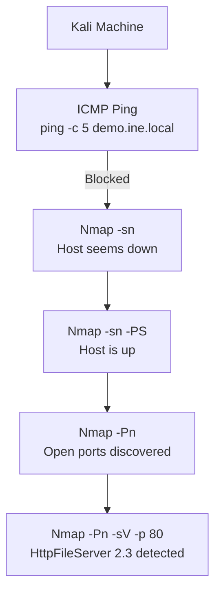

# Nmap Host Discovery Lab Notes

## Objective

Discover if `demo.ine.local` is online, find open ports, and identify running services.

## Environment

-   Attacker machine: Kali Linux (GUI access)
-   Target: `demo.ine.local` (IP: 10.2.23.9)

## Steps Performed

### 1. Host Discovery with ICMP

``` bash
nmap -sn 10.2.23.9
```

-   Result: `Host seems down`\
-   ICMP ping likely blocked by firewall.

### 2. TCP SYN Ping (Port Scan Ping)

``` bash
nmap -sn -PS 10.2.23.9
```

-   Result: Host is **up**.\
-   SYN ping worked even when ICMP was blocked.

### 3. TCP SYN Ping with Port Range

``` bash
nmap -sn -PS1-1000 10.2.23.9
```

-   Confirms host is up by probing multiple ports.

### 4. Skipping Host Discovery (-Pn)

``` bash
nmap -Pn 10.2.23.9
```

-   Treats host as online regardless of ping reply.\
-   Found open ports: `80, 135, 139, 445, 3389, 49154, 49155`.

### 5. Single Port Scan (443)

``` bash
nmap -Pn -p 443 10.2.23.9
```

-   Result: **filtered**\
-   Port filtering blocks probe responses (could be firewall/router
    rules).

### 6. Service Version Detection

``` bash
nmap -Pn -sV -p 80 demo.ine.local
```

-   Detected service: **HttpFileServer httpd 2.3** running on port 80.
-   OS fingerprint: Windows.

## Key Takeaways

-   ICMP ping is not reliable for host discovery (can be blocked).
-   Use `-PS` or `-Pn` to bypass ICMP restrictions.
-   **Filtered ports** mean probes are dropped or blocked, not
    necessarily closed.
-   `-sV` helps identify service versions for further exploitation or
    enumeration.

## Useful Nmap Options

  Option   Purpose
  -------- ----------------------------------------
  `-sn`    Host discovery only (no port scan)
  `-PS`    TCP SYN ping on given port(s)
  `-Pn`    Skip host discovery, assume host is up
  `-p`     Specify port(s) to scan
  `-sV`    Service version detection

## Conclusion

This lab demonstrated how to confirm host availability and enumerate
open ports/services even when ICMP is blocked by firewalls.


---
## Discovered Ports and Services

| Port | State    | Service        | Version/Info                |
|-----:|---------|---------------|----------------------------|
| 80   | open    | http          | HttpFileServer httpd 2.3    |
| 135  | open    | msrpc         | Microsoft RPC               |
| 139  | open    | netbios-ssn   | NetBIOS Session Service     |
| 445  | open    | microsoft-ds  | SMB / Windows File Sharing  |
| 3389 | open    | ms-wbt-server | RDP (Remote Desktop)        |
| 49154| open    | unknown       |                            |
| 49155| open    | unknown       |                            |
| 443  | filtered| https         | Possibly firewalled         |
