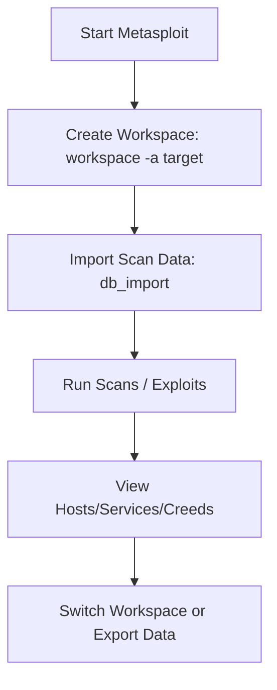

---

## Purpose

Workspaces in Metasploit help organize data from multiple engagements. Each workspace holds hosts, services, credentials, and sessions separately.

---

## Concept

- A **workspace** acts as a container for your penetration test data.
    
- Enables switching between projects or clients without overwriting results.
    
- Each workspace connects to its own section in the Metasploit database (msfdb).
    

---

## Commands

|Command|Description|
|---|---|
|`workspace`|List all available workspaces.|
|`workspace -a <name>`|Add a new workspace.|
|`workspace <name>`|Switch to an existing workspace.|
|`workspace -d <name>`|Delete a workspace and its data.|
|`workspace -r <old> <new>`|Rename a workspace.|
|`workspace -h`|Show workspace help options.|

---

## Typical Workflow

1. **Create a workspace** for your project:
    
    ```bash
    workspace -a clientA
    ```
    
2. **Import data** (Nmap or Nessus scans):
    
    ```bash
    db_import nmap_scan.xml
    ```
    
3. **Run auxiliary modules** for enumeration or scanning. Results are stored per workspace.
    
4. **List current workspace info:**
    
    ```bash
    hosts
    services
    creds
    ```
    
5. **Switch between projects**:
    
    ```bash
    workspace clientB
    workspace clientA
    ```
    
6. **Delete** unused workspaces to free space:
    
    ```bash
    workspace -d clientA
    ```
    

---

## Practical Example

```bash
msfconsole
workspace -a webapp_test
db_import /scans/webapp.xml
use auxiliary/scanner/http/http_header
set RHOSTS 10.10.10.0/24
run
hosts
services
workspace -a internal_network
```

---

## Tips

- Always create a new workspace for each engagement.
    
- Use clear, lowercase names (no spaces). Example: `workspace -a corp_network`.
    
- Combine workspaces with `db_export` for backups.
    
- Run `save` often to preserve global options and workspace configuration.
    

---

## Diagram



---

## Summary

Workspaces segment projects, improve organization, and reduce data mix-ups. Always verify the active workspace before scanning or importing results.

_End of workspace management note._