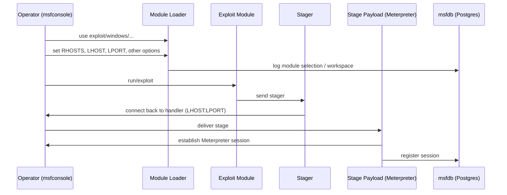

- module is a piece of code that can be utilized and executed by the MSF
- libraries - used to facilitate the execution of modules without having to write the code necessary to execute them
- exploit modules - used to take advantage of a vulnerability and is typically paired with a payload
- Payload - is the malicious code executed in target system after being exploited
- Encoder - Used to encode payloads in order to avoid AV Detection
- NOPS - used to ensure that the payload sizes are consistent. and ensure that the target system is stable when payloads are executed
- Auxiliary Module - is a module which cannot be paired with a payload. ex : port scanner module
### Payload types 
- Non-staged Payload - sent to the target system as a whole along with the exploit. 
- Staged Payload - sent to target into two parts
	- first part (stager)- contains a payload to initiate a reverse connection back to the attacker and download the second part of the payload (stage) and execute it
- #### Meterpreter Payload
	- is an advanced multi-functional payload that is executed in the memory on the target system, making it difficult to detect
	- it communicated over a stager socket and provides an attacker with an interactive command interpreter on the target system that facilitates the execution of system commands, file system navigation, keylogging and much more
### MSF File system structure 
- /usr/share.metasploit-framework/
- /usr/share.metasploit-framework/modules

---
# Metasploit Framework Architecture

---

> Contains Mermaid diagrams. In Obsidian enable "Preview" to render diagrams.

## High-level Architecture

```mermaid
flowchart LR
  subgraph User
    A[msfconsole / msfcli / GUIs]
  end

  subgraph Core
    B[Metasploit Libraries]
    C[Module Loader]
    D[Module Store]
    E[msfdb (PostgreSQL)]
    F[Workspace Manager]
  end

  subgraph Modules
    M1[Exploits]
    M2[Auxiliary]
    M3[Payloads]
    M4[Encoders]
    M5[NOPS]
    M6[Post modules]
  end

  subgraph Tools
    T1[msfvenom]
    T2[Resource Scripts]
    T3[Armitage / Community GUI]
    T4[WMAP / Nessus integration]
  end

  A --> B
  B --> C
  C --> D
  D --> M1
  D --> M2
  D --> M3
  D --> M4
  D --> M5
  D --> M6
  B --> E
  B --> F
  A --> T1
  A --> T2
  A --> T3
  A --> T4
  M3 --> Meterpreter[Meterpreter (in-memory)]
  Meterpreter --> Post[Post-exploitation modules]

```

---

## Module Execution Flow



---

## File system layout (Linux)

- `/usr/share/metasploit-framework/modules` - Core modules
    
- `~/.msf4/modules` - User modules
    
- `~/.msf4/msf.db` or PostgreSQL instance - Database
    

---

## Components and roles

- **msfconsole**: primary interactive interface.
    
- **msfdb (PostgreSQL)**: stores hosts, services, credentials, scan imports.
    
- **Module Loader**: locates and loads modules from module paths.
    
- **Modules**: Exploits, Auxiliary, Payloads, Encoders, NOPS, Post.
    
- **msfvenom**: payload generation and encoding tool.
    
- **Resource scripts**: automation and repeatable workflows.
    
- **GUIs (Armitage / Community)**: visualize targets and automate flows.
    
- **Workspaces**: separate engagements and store per-target data.
    

---

## How to use these diagrams in Obsidian

- Paste this note into an Obsidian vault.
    
- Toggle Preview mode to render Mermaid diagrams.
    
- Adjust node labels or add new subgraphs as needed.
    

---

## Quick tips

- Keep `~/.msf4/modules` for custom modules only.
    
- Ensure PostgreSQL/msfdb is running before heavy scans.
    
- Use workspaces to avoid data mix between engagements.
    

_End of architecture note._